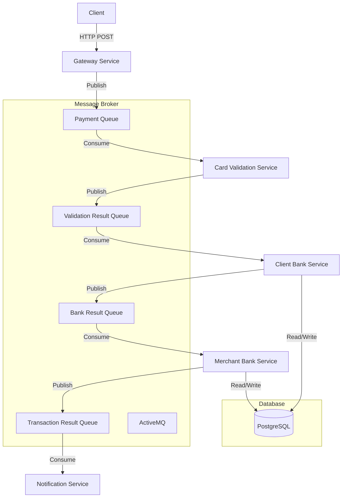

# Architecture du Système de Paiement Distribué

## Diagramme d'Architecture



## Description des Composants

### Services

1. **Gateway Service**
   - Point d'entrée unique
   - Validation des requêtes
   - Publication des messages

2. **Card Validation Service**
   - Validation des cartes
   - Vérification des dates d'expiration
   - Publication des résultats

3. **Client Bank Service**
   - Gestion des comptes clients
   - Vérification des soldes
   - Mise à jour des transactions

4. **Merchant Bank Service**
   - Gestion des comptes marchands
   - Traitement des paiements
   - Mise à jour des soldes

5. **Notification Service**
   - Envoi des notifications
   - Gestion des templates
   - Logging des notifications

### Files d'Attente

1. **Payment Queue**
   - Messages de paiement initiaux
   - Format : JSON
   - Priorité : Haute

2. **Validation Result Queue**
   - Résultats de validation
   - Format : JSON
   - Priorité : Moyenne

3. **Bank Result Queue**
   - Résultats des opérations bancaires
   - Format : JSON
   - Priorité : Haute

4. **Transaction Result Queue**
   - Résultats des transactions
   - Format : JSON
   - Priorité : Moyenne

### Base de Données

#### Tables

1. **Clients**
   - ID
   - Nom
   - Numéro de carte
   - Date d'expiration
   - Solde

2. **Merchants**
   - ID
   - Nom
   - Solde

## Flux de Données

1. **Initiation du Paiement**
   ```
   Client → Gateway Service → Payment Queue
   ```

2. **Validation de la Carte**
   ```
   Payment Queue → Card Validation → Validation Result Queue
   ```

3. **Vérification du Solde Client**
   ```
   Validation Result → Client Bank → Bank Result Queue
   ```

4. **Traitement Marchand**
   ```
   Bank Result → Merchant Bank → Transaction Result Queue
   ```

5. **Notification**
   ```
   Transaction Result → Notification Service
   ```

## Sécurité

1. **Validation des Entrées**
   - Vérification des formats
   - Sanitization des données
   - Validation des montants

2. **Isolation des Services**
   - Conteneurs Docker
   - Réseaux isolés
   - Permissions minimales

3. **Gestion des Erreurs**
   - Retry mechanism
   - Circuit breaker
   - Logging détaillé

## Performance

1. **Optimisations**
   - Mise en cache des connexions
   - Pool de connexions
   - Indexation de la base de données

2. **Monitoring**
   - Logs des services
   - Métriques de performance
   - Alertes automatiques 